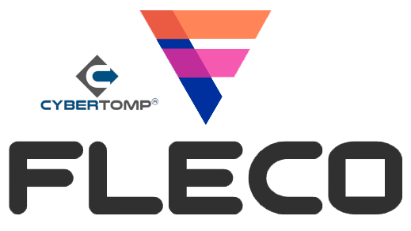

# PROJECT STATUS

## Master branch:


## Development branch:


# THE PROJECT



<b>CyberTOMP® FLECO</b> (Fast, Lightweight, and Efficient Cybersecurity Optimization) (1) is an adaptive and constrained genetic algorithm designed to assist the Asset's Cybersecurity Committee (as defined in CyberTOMP® Framework) in making decisions during the application of CyberTOMP® (2), aimed at managing comprehensive cybersecurity at both tactical and operational levels. It also provides a seamless integration to outsourced cybersecurity operation centers that could be cooperating with tyhe main organizations (3) to enhance the holistic cybersecurity management skills of the cross functional cybersecurity workforce.

It is developed as as a library that can be seamlessly incorporated into larger solutions to facilitate the identification of feasible cybersecurity solutions to reach the organization's strategic cybersecurity goals. 

1. Domínguez-Dorado, M.; Cortés-Polo, D.; Carmona-Murillo, J.; Rodríguez-Pérez, F.J.; Galeano-Brajones, J. Fast, Lightweight, and Efficient Cybersecurity Optimization for Tactical–Operational Management. Appl. Sci. 2023, 13, 6327. https://doi.org/10.3390/app13106327
2. Dominguez-Dorado, M., Carmona-Murillo, J., Cortés-Polo, D., and Rodríguez-Pérez, F. J. (2022). CyberTOMP: A novel systematic framework to manage asset-focused cybersecurity from tactical and operational levels. IEEE Access, 10, 122454-122485. https://doi.org/10.1109/ACCESS.2022.3223440
3. Domínguez-Dorado, M.; Rodríguez-Pérez, F.J.; Carmona-Murillo, J.; Cortés-Polo, D.; Calle-Cancho, J. Boosting Holistic Cybersecurity Awareness with Outsourced Wide-Scope CyberSOC: A Generalization from a Spanish Public Organization Study. Information 2023, 14, 586. https://doi.org/10.3390/info14110586

# LICENSE

## Latest snapshot version being developed:

- <b>CyberTOMP® FLECO Library v2-SNAPSHOT</b> (develop branch) - LGPL-3.0-or-later.

## Binary releases:
 
- <b>CyberTOMP® FLECO Library v1</b> (current, master branch) - LGPL-3.0-or-later.
- <b>FLECO 2.0</b> LGPL-3.0-or-later.
- <b>FLECO 1.4</b> LGPL-3.0-or-later.
- <b>FLECO 1.3</b> LGPL-3.0-or-later.
- <b>FLECO 1.2</b> LGPL-3.0-or-later.
- <b>FLECO 1.1</b> LGPL-3.0-or-later.
- <b>FLECO 1.0</b> LGPL-3.0-or-later.

# PEOPLE BEHIND CyberTOMP® FLECO Library

## DEVELOPMENT LEADER:
    
 - Manuel Domínguez-Dorado - <ingeniero@ManoloDominguez.com>
   
# ARTIFACTS AVAILABILITY

You can download latest compiled stable releases from the releases section of this repository. Also, since release v1 CyberTOMP® FLECO Library is in Maven Central so you can add it as a dependecy in your Maven project inserting the following in your pom.xml:
```console
<dependency>
    <groupId>com.manolodominguez</groupId>
    <artifactId>cybertomp-fleco-library</artifactId>
    <version>v1</version>
</dependency>
```
For othe project builders (graddle, buildr...) see the next link in Maven Central: https://central.sonatype.com/artifact/com.manolodominguez/cybertomp-fleco-library/v1

# COMPILING FROM SOURCES

The optimal course of action entails acquiring the most recent compiled stable releases from the releases section of this repository. Nevertheless, if one desires to assess novel functionalities, it becomes imperative to compile the project from its sources. The subsequent instructions outline the necessary steps to accomplish this task:

- Clone the CyberTOMP® FLECO Library repository: 

```console
git clone https://github.com/cybertomp-framework/cybertomp-fleco-library.git
```

- To obtain a binary JAR file containing all the necessary components, it is essential to compile the code. Prior to that, it is imperative to install Maven:

```console
cd cybertomp-fleco-library
mvn package
```

- The jar file will be located in "target" directory.

# THIRD-PARTY COMPONENTS

CyberTOMP® FLECO Library utilizes several third-party components, each of which is governed by its own open-source software (OSS) license. In order to ensure compliance with these licenses, thorough consideration has been given to enable the release of CyberTOMP® FLECO Library under its existing OSS license. The components integrated within CyberTOMP® FLECO Library encompass the following:

- unirest-java-core 4.2.7 - MIT - https://kong.github.io/unirest-java/
- everit-json-schema 1.14.4 - Apache-2.0 - https://github.com/everit-org/json-schema
- slf4j-api 2.1.0-alpha1 - MIT - https://www.slf4j.org
- slf4j-simple 2.1.0-alpha1 - MIT - https://www.slf4j.org

Thanks folks!

# USING CyberTOMP® FLECO LIBRARY

Utilizing CyberTOMP® FLECO Library is remarkably straightforward. Begin by downloading the artifact and incorporating it into your project. Subsequently, adhere to the following instructions:

Specify the parameters for the the algorithm.

```java
// Number of potential solutions in the population
int initialPopulation = 30;  

// Seconds before stopping if no solutions are found
int maxSeconds = 5 * 60;  

// A standar crossover probability in the range [0.0f - 1.0f]
float crossoverProbability = 0.90f;  

// Select IG1, IG2, IG3 depending on whether the corresponding asset requires
// LOW, MEDIUM or HIGH cybersecurity.
ImplementationGroups implementationGroup = ImplementationGroups.IG3; 
```

Subsequently, proceed to generate and establish the current cybersecurity status of your asset based on the CyberTOMP® proposal. It is essential to configure the value of each allele within the chromosomes individually to accurately reflect the anticipated outcome of your asset. This can be achieved by making sequential calls to the updateAllele(gene, allele) method. For example:

```java
Chromosome initialStatus = new Chromosome(implementationGroup);
initialStatus.updateAllele(Genes.PR_AC_PR_AC_3, Alleles.DLI_67);
initialStatus.updateAllele(Genes.PR_AC_PR_AC_4, Alleles.DLI_67);
initialStatus.updateAllele(Genes.PR_AC_PR_AC_5, Alleles.DLI_0);
initialStatus.updateAllele(Genes.PR_AC_PR_AC_7, Alleles.DLI_67);
initialStatus.updateAllele(Genes.PR_AT_PR_AT_1, Alleles.DLI_0);
initialStatus.updateAllele(Genes.PR_DS_CSC_3_4, Alleles.DLI_100);
initialStatus.updateAllele(Genes.PR_DS_PR_DS_3, Alleles.DLI_67);
initialStatus.updateAllele(Genes.PR_IP_9D_9, Alleles.DLI_0);
initialStatus.updateAllele(Genes.PR_IP_CSC_11_1, Alleles.DLI_100);
initialStatus.updateAllele(Genes.PR_IP_CSC_4_3, Alleles.DLI_100); 
```

And so on.

Continuing with the process, the subsequent step involves creating and defining the strategic cybersecurity goals and constraints. FLECO will strive to identify a new cybersecurity state, referred to as the "target state," which satisfies all of these goals. This will be achieved by starting from the current cybersecurity state, known as the "initial state," and determining the set of actions required to reach the target state. For example, a set of strategic goals could include:

```java
StrategicConstraints strategicConstraints = new StrategicConstraints(implementationGroup);
// Asset constraint
strategicConstraints.addConstraint(new Constraint(ComparisonOperators.GREATER, 0.65f));
// Functions constraints
strategicConstraints.addConstraint(Functions.IDENTIFY, new Constraint(ComparisonOperators.GREATER_OR_EQUAL, 0.6f));
// Category constraints
strategicConstraints.addConstraint(Categories.RC_CO, new Constraint(ComparisonOperators.LESS, 0.8f));
strategicConstraints.addConstraint(Categories.PR_AC, new Constraint(ComparisonOperators.GREATER, 0.6f));
strategicConstraints.addConstraint(Categories.ID_SC, new Constraint(ComparisonOperators.GREATER_OR_EQUAL, 0.5f));
// Expected outcomes constraints
strategicConstraints.addConstraint(Genes.RC_CO_RC_CO_3, new Constraint(ComparisonOperators.GREATER, 0.6f));
strategicConstraints.addConstraint(Genes.RS_MI_RS_MI_3, new Constraint(ComparisonOperators.GREATER_OR_EQUAL, 0.3f));
strategicConstraints.addConstraint(Genes.DE_DP_DE_DP_5, new Constraint(ComparisonOperators.EQUAL, 0.67f));
strategicConstraints.addConstraint(Genes.DE_AE_DE_AE_5, new Constraint(ComparisonOperators.LESS, 0.6f));
strategicConstraints.addConstraint(Genes.PR_PT_9D_7, new Constraint(ComparisonOperators.LESS_OR_EQUAL, 0.6f));
strategicConstraints.addConstraint(Genes.ID_BE_ID_BE_3, new Constraint(ComparisonOperators.GREATER_OR_EQUAL, 0.7f));
```
As demonstrated, these goals can be defined at various levels within the CyberTOMP®'s hierarchy of metrics.

Moving forward, instantiate the FLECO algorithm by initializing it with the aforementioned definitions.
        
```java
FLECO fleco;
fleco = new FLECO(initialPopulation, maxSeconds, crossoverProbability, implementationGroup, initialStatus, strategicConstraints);
```

To facilitate the monitoring of FLECO's execution progress, it is advisable to establish a default progress event listener. This listener is designed with the sole purpose of printing relevant information in the console, enabling continuous visibility into the ongoing operations of the algorithm.

```java
fleco.setProgressEventListener(new DefaultProgressEventListener());
```

Concludingly, invoking the "evolve()" method will initiate the operation of FLECO until a solution is discovered or the designated time period, specified as maxSeconds, elapses. Upon completion, the best chromosome can be retrieved, and its constituent genes can be printed for examination.

```java
fleco.evolve();
fleco.getBestChromosome().print();
```

The best chromosome obtained represents the target status, encompassing both its genes and their associated values. This set of cybersecurity actions exemplifies a high-quality collection that necessitates implementation to fulfill the strategic cybersecurity goals and constraints. In subsequent executions of FLECO with the same configuration, additional solutions, if they exist, may be discovered.

This example can be found in [SimpleExample.java](src/main/java/com/manolodominguez/experiments/SimpleExample.java)
